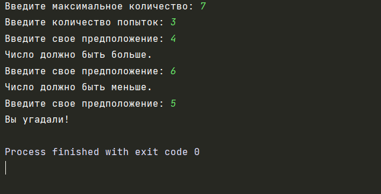
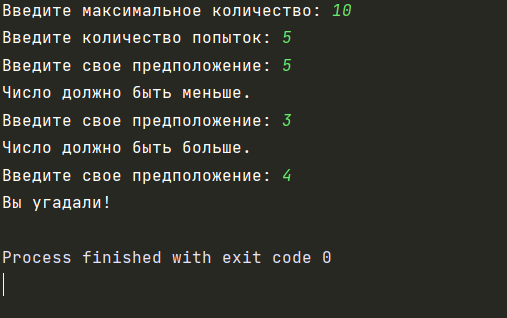

## Автор: 
Шляпникова Елена

## Описание:
Программа загадывает число от 1 до N. У пользователя k попыток отгадать. 
После каждой неудачной попытки компьютер сообщает меньше или больше загаданное число.

## Тесты:

## Инструкция:

Для использования программы необходимо выполнить следующие действия:
1) Запустить программу
2) Ввести максимальное число
3) Ввести количество попыток
3) Получить результат выполнения
